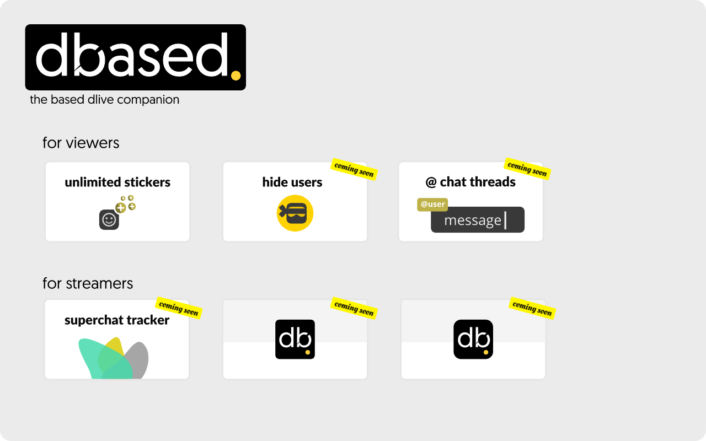

<div align="center">


<p>by 
&nbsp;<a rel="noopener noreferrer" target="_blank" href="https://twitter.com/Zoomer_Dev">@zoomer_dev</a></p>
<h2>Dbased - the based Dlive companion</h2>

<div align="">
<a rel="noopener noreferrer" target="_blank" href="https://chrome.google.com/webstore/detail/dbased-based-dlive/bjnemjdjapmakafpckmbdanhglffgpoc" alt="chrome-webstore-badge"></a>
<a rel="noopener noreferrer" target="_blank" href="https://addons.mozilla.org/en-US/firefox/addon/dbased-based-dlive/" alt="firefox-addon-badge"></a>
</div>
</div>

## Features


### for users
**unlimited saved stickers**  
Save unlimited stickers in your personal collection. Will not affect saved stickers in the mobile app or any client without this extension.

[coming soon] **hide users**   
Hide select users in chats and streamers from the home page.

[coming soon] **DM mentions style chat threads**   
Show a separate feed for chats that have `@` mentioned you, similar to a twitter thread.


### for streamers

[coming soon] **superchat tracker**   
All the functionality of [the dlive superchats site](https://github.com/zoomerdev/dlive-superchats) but integrated into the dlive website, negating the need to have a separate page open to see a donation chat log.


## Contributing

### Install Dependencies
```sh
yarn install
```
### Building
Development:
```sh
yarn dev
```

Production:
```sh
yarn build
```
