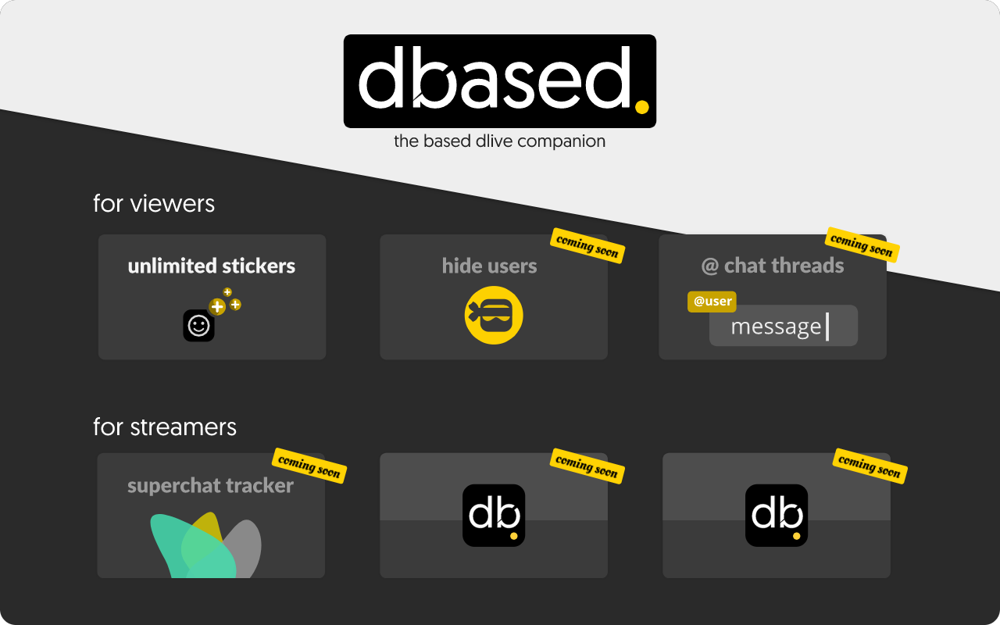

<div align="center">


<h2>Dbased - the based Dlive companion</h2>

<div align="">
<a href="#" alt="chrome-webstore-badge"></a>
<a href="#" alt="firefox-addon-badge"></a>
</div>
</div>

## Features


### for users
**unlimited saved stickers**  
Save unlimited stickers in your personal collection. Will not affect saved stickers in the mobile app or any client without this extension.

(coming soon) **hide users**   
Hide select users in chats and streamers from the home page.

(coming soon) **DM mentions style chat threads**   
Show a separate feed for chats that have `@` mentioned you, similar to a twitter thread.


### for streamers

(coming soon) **superchat tracker**   
All the functionality of [the dlive superchats site](https://github.com/zoomerdev/dlive-superchats) but integrated into the dlive website, negating the need to have a separate page open to see a donation chat log.


## Contributing

### Install Dependencies
```sh
yarn install
```
### Building
Development:
```sh
yarn dev
```

Production:
```sh
yarn build
```
